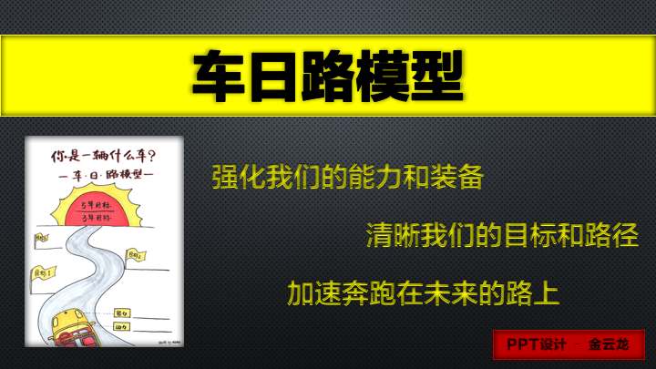

## 超体路径

### [车日路模型](./01-车日路模型)

### [两个职业体系](./02-两个职业体系)

### [高感性6种能力](./03-高感性6种能力)

### [未来职业三种人](./04-未来职业三种人)

### [自由职业态](./05-自由职业态)

## 版权说明

本套笔记的内容免费开源，任何人都可以免费学习、分享，甚至可以进行修改。但需要注明作者及来源，并且不能用于商业。

 本套笔记采用<a rel="license" href="http://creativecommons.org/licenses/by-nc-nd/4.0/">知识共享署名-非商业性使用-禁止演绎 4.0 国际许可协议</a>进行许可。